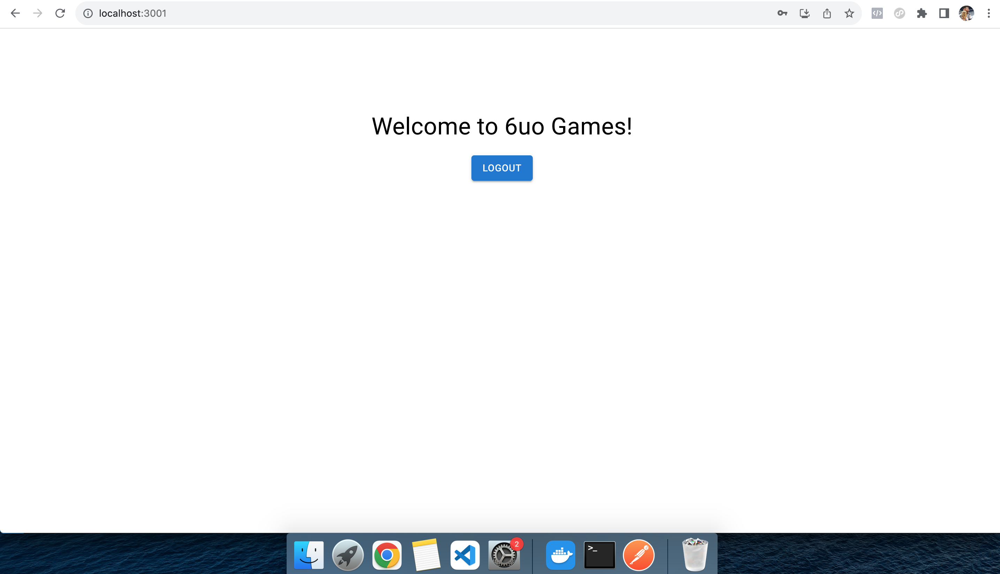

SORRY FOR THE LATE SUBMISSION

I encountered a lot of issues in my development environment that I had to troubleshoot it first before actually doing the coding test.

Here are the issues I found:

1. Data Dictionary Initialization Failed
   
    As you can see in the picture below, I got some data initialization failure with the provided docker volume for the MySQL database:

    

    So I had to create my own database volume in the docker compose file in question1 as shown in the picture below:

    

2. Authentication Table Doesn't Exist

    I guess it's related to issue #1. Because I had to create my own database volume, the table had to be initialized first and the data had to be populated.

    

    So I created this init_table.sql file and populate_data section in docker compose file, as shown in these pictures:

    

    

3. Pool Overlaps With The Provided Docker Network

    It's related to this StackOverflow issue:

    [ERROR: Pool overlaps with other one on this address space when starting my_project docker setup](https://stackoverflow.com/questions/56515128/error-pool-overlaps-with-other-one-on-this-address-space-when-starting-my-proje)

    So I had to replace it with 

    
  


So here are the results of my test:

Question 1:


Question 2:




Question 3:


HOW TO RUN THE PROJECTS:

  In the root directory I have created a Makefile file to run each project. 

  From the root folder, to run question 1 (API) at [http://localhost:3000](http://localhost:3000):
  ```
  make run-question1
  ```

  to run question 2 (login UI) at [http://localhost:3001](http://localhost:3001):
  ```
  make run-question2
  ```

  to run question 3 (debugging) at [http://localhost:3002](http://localhost:3002):
  ```
  make run-question3
  ```


  You can also run all the projects simultaneously:

  ```
  make run
  ```

  NOTE: Make sure the API (question 1) is already running in order for the question 2 and question 3 to be able to run correctly

  ALSO make sure you have run:
  ```
  npm install
  ```

  in each project (question 1, question 2, and question 3)